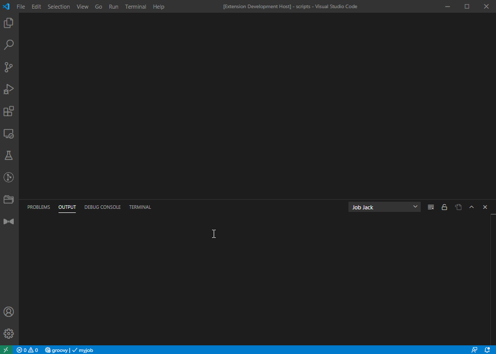
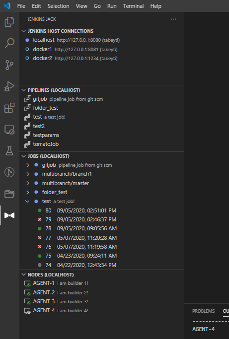

# Jenkins Jack

Are you tired of bloated extensions with superfluous features that are so confusing to use, you'd rather do everything manually?

I'm not!

Jack into your Jenkins to streamline your Pipeline development and Jenkins management. Execute Pipeline scripts remotely with real-time syntax highlighted output, access Pipeline step auto-completions, pull Pipeline step documentation, run console groovy scripts across multiple agents, manage jobs/builds/agents, and more!

Honestly, not that much more.

## Features

* Pipeline Jack
    * Execute (with build parameters)
        * Stream syntax highlighted output to output channel
    * Abort executed pipeline
    * Update target pipeline job on host with script
    * Shared Library reference docs
* Script Console Jack
    * Execute groovy console script at the System level or across one or more agents
* Node (agent) Jack
    * Disable (with an offline message), enable, or disconnect one or more nodes
    * Update the labels on one more more nodes
    * Open agent in web browser
* Job Jack
    * Disable, enable, delete, or view one or more jobs
    * Open job in web browser
* Build Jack
    * Download a build log
    * Download a build's replay script
    * Delete one or more builds
    * Open build in web browser
* Add, delete, edit, and select Jenkins host connections
* Pipeline (GDSL) auto-completions for `groovy` files
* Tree Views
    * Connection Tree
        * Add, edit, delete, and select your Jenkins host connections here
    * Pipeline Tree
        * Manage local scripts in relation to jobs on the targeted host
        * Pull job script from host
        * Pull replay script from build on host
        * Re-open your pulled script; association saved in `settings.json`
    * Job Tree
        * View jobs and builds on the host
        * Disable, enable, delete jobs and builds on the targeted host
    * Node (agent) Tree
        * View nodes on the host
        * Disable (with offline message), enable, disconnect nodes on the targeted host
        * Update one or more nodes labels

## Jacks!

See [COMMANDS.md](COMMANDS.md) for a more comprehensive list of commands and their use.

|Jack|Description|Command|
|---|---|:---|
|__Pipeline__|Remotely execute/abort/update Jenkins pipeline scripts from an open file with Groovy language id set, streaming syntax highlighted logs to the output console.|`extension.jenkins-jack.pipeline`|
|__Script Console__|Remotely execute Console Groovy scripts through the Jenkins Script Console, targeting one or more agents.|`extension.jenkins-jack.scriptConsole`|
|__Build__|Delete/abort builds, stream logs, and pull Pipeline replay scripts from your Jenkins host.|`extension.jenkins-jack.build`|
|__Job__|Disable/enable/delete one or more jobs from your remote Jenkins.|`extension.jenkins-jack.job`|
|__Node__|Disable/enable/disconnect one or more agents from your remote Jenkins. Mass update agent labels as well.|`extension.jenkins-jack.node`|

Individual jacks can be mapped to hot keys as user sees fit.

## Views

The extensions comes with UI/Views for interacting with all Jacks. The views can be found in the activity bar on the left hand side of the editor (bow icon):



All commands a user can execute via the quickpick command list (`ctrl+shift+j`) can also be executed in the Views via context menu or buttons.

For examples on interacting with the views, see [TUTORIAL.md](TUTORIAL.md).

## Auto-completions (faux snippets)

From the selected remote Jenkins, the extension will pull, parse, and provide Pipeline steps as auto-completions from the Pipeline step definitions (GDSL).

Any file in the editor with the Groovy language id set will have these completions (can be disabled via settings).

## Settings

|Name |Description |
| --- | ---------- |
| `jenkins-jack.jenkins.connections` | List of jenkins connections (uri, username, and password) a user can switch between for running commands |
| `jenkins-jack.jenkins.strictTls` | If unchecked, the extension will **not** check certificate validity when connecting through HTTPS |
| `jenkins-jack.pipeline.params.enabled` | Enables/disables use of build parameters when executing a Pipeline |
| `jenkins-jack.pipeline.params.interactiveInput` | When enabled, during Pipeline execution a user will be presented with input boxes to enter values for build parameters discovered on the Pipeline job |
| `jenkins-jack.pipeline.browserBuildOutput` | Show build output via browser instead of the `OUTPUT` channel |
| `jenkins-jack.pipeline.browserSharedLibraryRef` | Show Pipeline Shared Library documentation via browser instead of within vscode as markdown |
| `jenkins-jack.outputView.type` | The output view type (e.g. `OUTPUT` window or editor window) |
| `jenkins-jack.outputView.panel.defaultViewColumn` | he default view column (location) in vscode the output panel will spawn on show. See https://code.visualstudio.com/api/references/vscode-api#ViewColumn |
| `jenkins-jack.snippets.enabled` | Enable Pipeline step snippets for editors windows with the Groovy language id set |
| `jenkins-jack.pipeline.tree.items` | Pipeline Tree View local script to host Pipeline job associations (updated by extension) |

## Setup

See [TUTORIAL.md](TUTORIAL.md##setting-up-a-connection) for setup and basic usage.

## Quick-use

### `ctrl+shift+j`

Displays a list of all Jack commands provided by the extension (`extension.jenkins-jack.jacks`)

## Local Packaging and Installation
To create a standalone `vsix` for installation locally, run the following commands:
```bash
# From the root of the extension.
npm install -g vsce     # For packaging
npm install             # Install dependencies.
vsce package            # Bake some bread.
code --install-extension .\jenkins-jack-0.0.1.vsix # ...or whatever version was built
```

## Support
Do you have a feature request or would like to report a bug? Super duper! Create an issue via Github's [issue tracker](https://github.com/tabeyti/jenkins-jack/issues).

Currently, there are no hard guidelines defined for feature requests, bugs, or questions since I have no idea what I'm doing. These will become more defined as interest in the project increases or something something.

## Authors

* **Travis Abeyti** (*initial work*)

## License

This project is licensed under the MIT License - see the [LICENSE.md](LICENSE.md) file for details. Do what you will with this.
