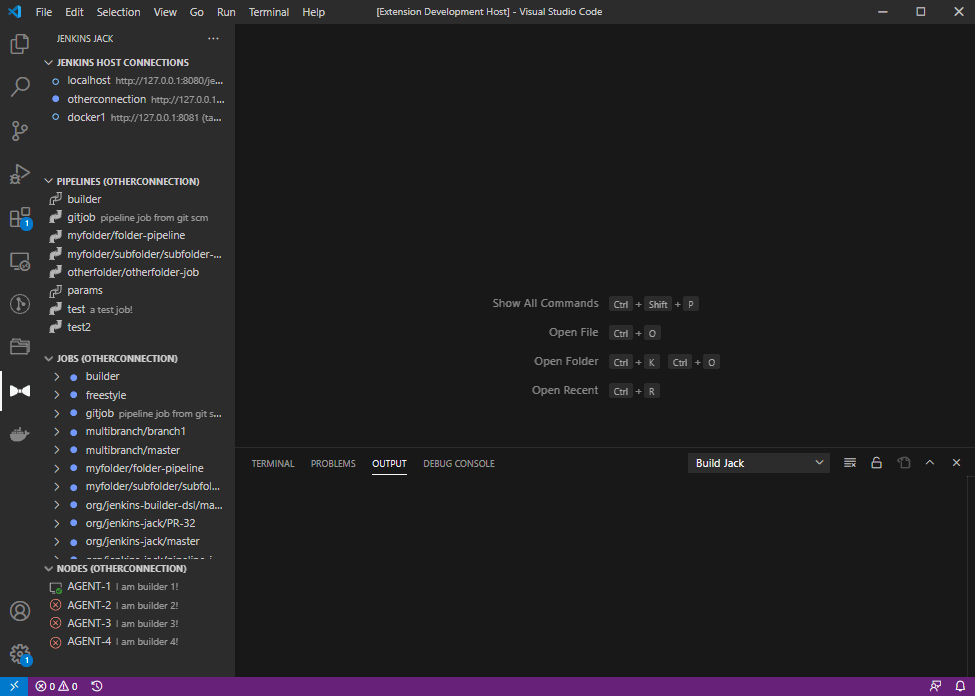
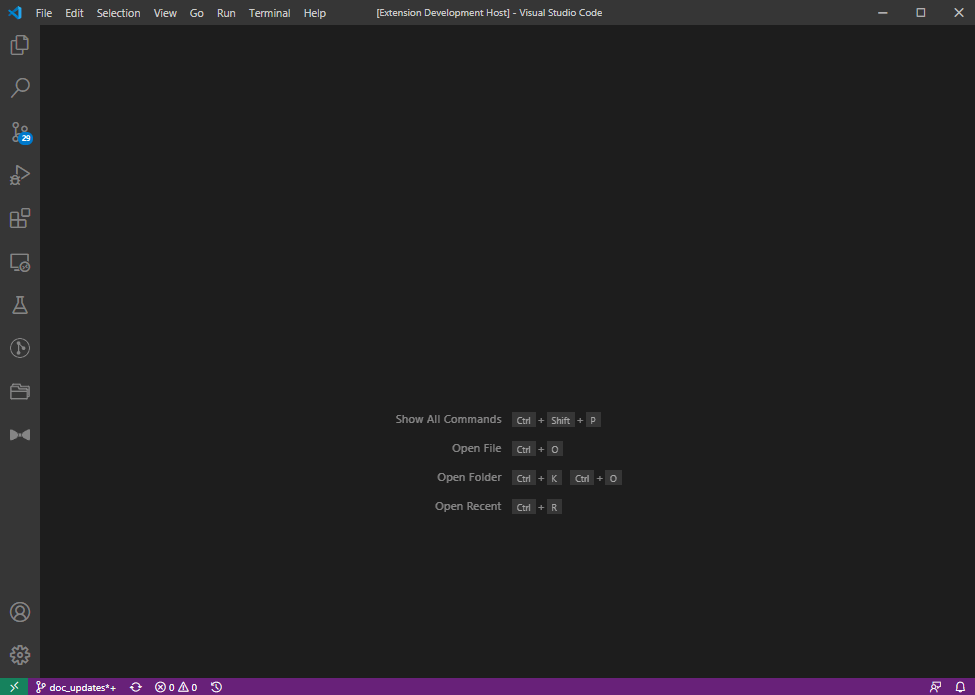
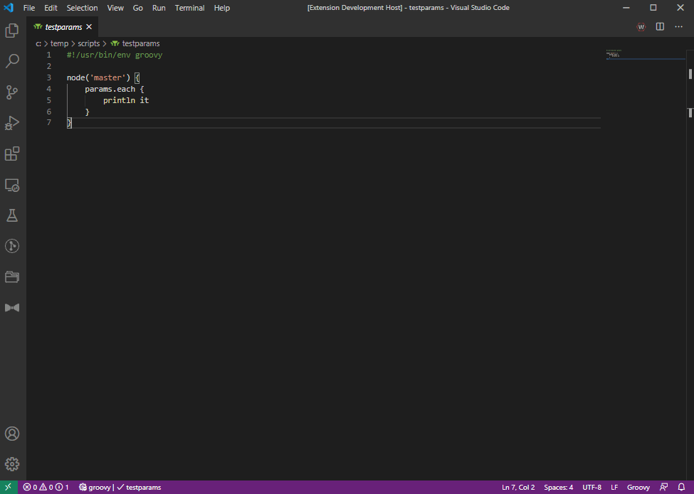
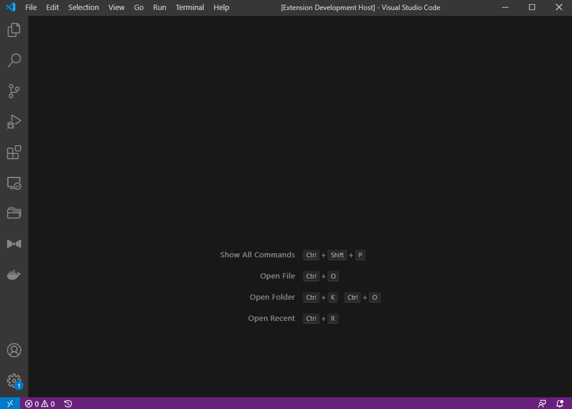

# Tutorial

All commands can either be handled in the quick-pick command menu (`ctrl+shift+j`) or through the Jenkins Jack Views (bow icon on the left bar).

## Setting up a Connection

The preferred method of authentication for the extension uses a generated [API token](https://www.jenkins.io/blog/2018/07/02/new-api-token-system/) which can be made by visiting your user configuration (e.g. `https://jenkins-server/user/tabeyti/configure`)


Host connections can be added through the __Connection: Add__ quick-pick command or the Connection Tree View. Inputs needed:
* A unique name for this connection (e.g. `myconn`)
* The base Jenkins address with `http/https` prefix
* Your user name for the Jenkins server
* The API token you generated for your user
* (Optional) A folder path on the Jenkins to filter job queries and commands. Can be used for performance (limits number of jobs queried) or for quality-of-life when working within a specific location on Jenkins.
* (Optional) CSRF projection for your connection (default true). __Only disable this for older [Jenkins versions](https://www.jenkins.io/doc/book/security/csrf-protection/)__ (pre 2.222) if you experience issues creating/editing jobs, builds, and nodes.

Connection data is stored in the `settings.json`:

```javascript
"jenkins-jack.jenkins.connections": [
    {
        // Unique name for your Jenkins connection
        "name": "localhost",

        // Host and credentials
        "uri": "http://127.0.0.1:8080/jenkins",
        "username": "<your username>",
        "password": "<your password/token>",

        // (Optional) Folder path on the Jenkins for filtering job queries
        "folderFilter": "",

        // (Optional) Flag to disable CSRF protection for older Jenkins' (default is true)
        "crumbIssuer": true

        // Flag indicating whether the connection is active.
        // NOTE: Avoid setting this manually and use the extension commands for selecting an active connection
        "active": true
    },
    ...
]
```

---

## Creating a Pipeline


* Create a Pipeline job and local script through the quick-pick command or the Tree View. User can select root or a Jenkins Folder job to create the Pipeline under.

---

## Executing a Pipeline



* Run a pipeline script from a local Groovy file on your machine
* Pull a job or replay script from the host in the Pipeline Tree View, creating a link between the saved script and the host's job for easy access and execution in the Pipeline Tree View
* Link a Pipeline job found on the host to an already existing local script for easy access and execution

---

## Execute a Pipeline with Build Parameters



* A user can modify build input/parameters in the `.<your_script>.config.json` config file local to the script (created on pipeline execution). You can also access script config quickly through the Pipeline Tree View context menu
* Interactive input can be enabled in settings to prompt a user for values on each build parameter (only supports Jenkins default parameter types) during Pipeline execution

---

## Query Builds

* Use VSCode's quick-pick search with wild-card support to query builds by date, result, duration, and description for any build operation (e.g. open, delete, download log, etc.)
* Limit or expand the number of builds to retrieve for performance or more search results




## Job and Build Management

> TODO
