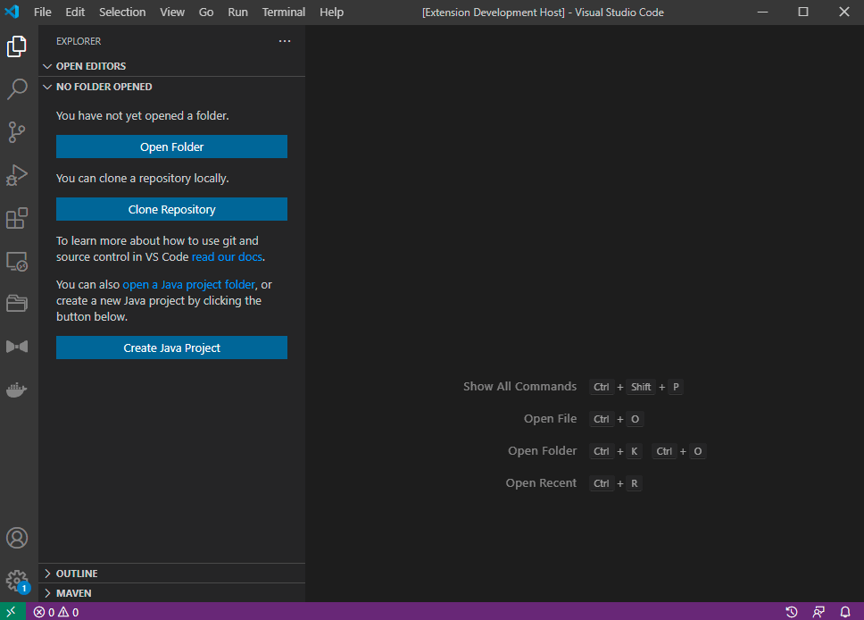

# Tutorial

All commands can either be handled in the quickpick command menu (`ctrl+shift+j`) or through the Jenkins Jack Views (bow icon on the left bar).

## Setting up a Connection


Add a host connection through quickpick command or the Connection Tree View (connections are stored in `settings.json`)

```javascript
"jenkins-jack.jenkins.connections": [
    {
        // Unique name for your Jenkins connection
        "name": "localhost",

        // Host and credentials
        "uri": "http://127.0.0.1:8080/jenkins",
        "username": "<your username>",
        "password": "<your password/token>",

        // (Optional) Folder path on the Jenkins for filtering job queries
        "folderFilter": "",

        // (Optional) Flag to disable CSRF protection for older Jenkins' (default is true)
        "crumbIssuer": true

        // Flag indicating whether the connection is active.
        // NOTE: Avoid setting this manually and use the extension commands for selecting an active connection
        "active": true
    },
    ...
]
```

---

## Executing a Pipeline


* Run a pipeline script from a local Groovy file on your machine
* Pull a job or replay script from the host in the Pipeline Tree View, creating a link between the saved script and the host's job for easy access and execution in the Pipeline Tree View
* Link a Pipeline job found on the host to an already existing local script for easy access and execution

---

## Execute a Pipeline with Build Parameters


* A user can modify build input/parameters in the `.<your_script>.json` config file local to the script (created on pipeline execution). You can also access script config quickly through the Pipeline Tree View context menu
* Interactive input can be enabled in settings to prompt a user for values on each build parameter (only supports Jenkins default parameter types) during Pipeline execution

---

## Job and Build Management

* Open/disable/enable/delete jobs from the targeted Jenkins
* Open/delete/abort builds as well as download logs and replay scripts (if Pipeline)